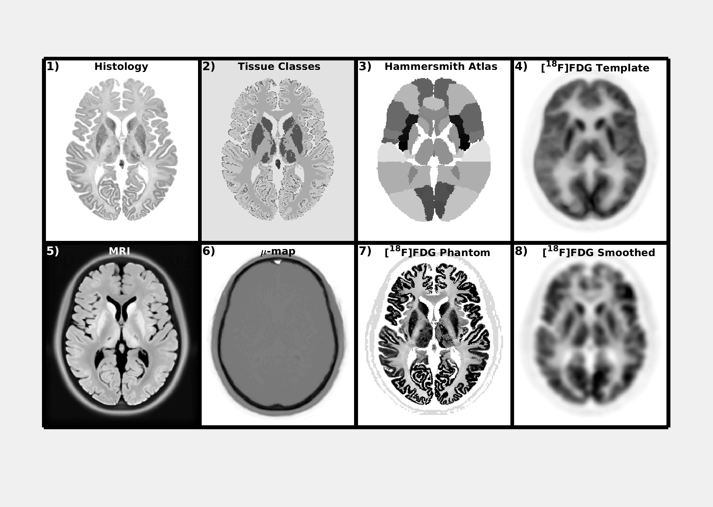

## High-Resolution Heterogeneous Digital PET Brain Phantom based on the BigBrain Atlas 
##### M A Belzunce and A J Reader

Here we propose a new PET brain phantom based on the [Bigbrain](https://bigbrain.loris.ca/main.php) human brain model. The complete proposed dataset includes an [18F]FDG phantom, a pseudo CT, a μ-map and a T1-weighted image, that allows user to simulate PET and PET-MR data. The phantom is publicaly available in different formats (see below). A set of simulated scans for the Siemens Biograph mMR scanner is also available for different noise levels.

### Rationale of the Phantom 
In positron emission tomography (PET), the evaluation of image reconstruction algorithms needs realistic simulated data sets where the ground truth is known and the image quality and the quantification errors can be evaluated. In the context of brain imaging, qualitative and quantitative assessments of the radiotracer uptake in anatomical regions, such as the striatum or the cortical grey matter, are important to study brain disorders. Therefore, brain phantoms that emulate brain scans are then needed to assess the accuracy of reconstruction and post-processing algorithms. However, most of the available digital brain phantoms are usually of limited spatial resolution making them not ideal to evaluate quantification errors due to the partial volume effect (PVE). In addition, they are piece-wise constant and usually generated from segmented MRI images of the brain. As a result, quantitative errors can be underestimated when doing regularized MR-guided reconstructions.

### The Proposed Phantom
A realistic [18F]FDG digital phantom that overcomes the problems of the current PET digital brain phantoms, particularly for the simulation of simultaneous PET-MRI data sets, was created using the method described in (reference to abstract). In the latter, the histology  images and a tissue classified volume  of the BigBrain atlas is used to define the high resolution structures of the phantom. Then, the uptake in different regions of the brain is estimated using the Hammersmith brain atlas and a reconstructed image of real data from an [18F]FDG study.

### What the Phantom looks like?

### Download Phantom Data Set
The phantom data set consists of the PET phantom, a T1-weighted MRI image, a CT image and an attenuation map for 511 keV. They are available in three different resolutions: 200 

* **100 &#181;m**

    - Nifti
    
        - PET image:
        
        - MRI image:
        
        - CT image:
        
        - Attenuation map image:
        
    - MATLAB
    
        - MATLAB structure with the full data set:
        
    - Raw
    
        - PET image:
        
        - MRI image:
        
        - CT image:
        
        - Attenuation map image:
            
* **400 &#181;m**

    - Nifti
    
        - PET image:
        
        - MRI image:
        
        - CT image:
        
        - Attenuation map image:
        
    - MATLAB
    
        - MATLAB structure with the full data set:
        
    - Raw
    
        - PET image:
        
        - MRI image:
        
        - CT image:
        
        - Attenuation map image:
        
* **1 mm**

    - Nifti
    
        - PET image:
        
        - MRI image:
        
        - CT image:
        
        - Attenuation map image:
        
    - MATLAB
    
        - MATLAB structure with the full data set:
        
    - Raw
    
        - PET image:
        
        - MRI image:
        
        - CT image:
        
        - Attenuation map image:

### Download Phantom Data Set
Simulated data for the Siemens Biograph mMR scanner:

### Download Functions to Evalute Reconstruction
This is a set of functions to evalute reonstructed images:

### CONTACT
For questions or further information:
<a href="martin.belzunce@kcl.ac.uk">martin.belzunce@kcl.ac.uk</a>