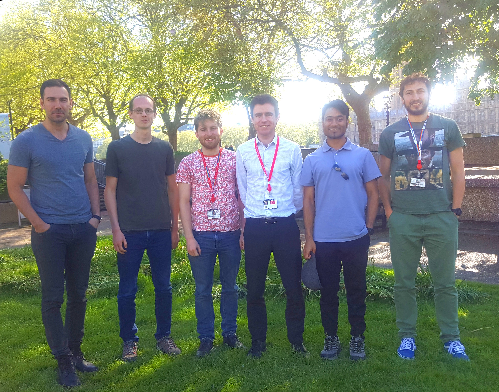

{{ site.data.people.pi[0].name }}'s image reconstruction research group at  
King's College London, St Thomas' Hospital, London SE1&nbsp;7EH, UK

# People

- [![{{ mem.name }}][{{ mem.name }}-pure-badge]](#pure-{{ mem.name | replace: ' ', '_' }})
[![][{{ mem.name }}-github-badge]][{{ mem.name }}-github]


## Post-docs

- 
  [![{{ mem.name }}][{{ mem.name }}-pure-badge]][{{ mem.name}}-pure]
  [![{{ mem.name }}][{{ mem.name }}-rg-badge]][{{ mem.name}}-rg]
  [![][{{ mem.name }}-github-badge]][{{ mem.name }}-github]
  ![][{{ mem.name }}-left-badge]


## PhD Students

- [![{{ mem.name }}][{{ mem.name }}-pure-badge]][{{ mem.name}}-pure]
  [![][{{ mem.name }}-cdt-badge]][{{ mem.name }}-cdt]
  [![{{ mem.name }}][{{ mem.name }}-rg-badge]][{{ mem.name}}-rg]
  [![][{{ mem.name }}-github-badge]][{{ mem.name }}-github]
  ![][{{ mem.name }}-left-badge]


# Downloads

## Projects

- Brain phantoms
    + [BrainWeb-based multimodal models of 20 normal brains][brainweb]
    + [NiftyML]
    + [High-Resolution Heterogeneous Digital Brain Phantom][brain_phantom]
    + [The NURBS-based HUman Brain (NHUB) Phantom][nhub]
- PET Image Reconstruction Libraries
    + [NiftyPET]
    + [SIRF]
    + [APIRL]

[brain_phantom]: ./brain_phantom/ "downloadable digital brain phantom"
[brainweb]: ./brainweb/ "downloadable digital brain phantoms"
[nhub]: https://github.com/casperdcl/brain_phantom "Source code"
[NiftyPET]: https://github.com/NiftyPET/NIPET "Source code"
[NiftyML]: https://github.com/NiftyPET/NiftyML "Source code"
[SIRF]: https://github.com/CCPPETMR/SIRF "Source code"
[APIRL]: https://github.com/PET-MR/apirl "Source code"

## Misc

- [*Multi-modal weighted quadratic priors for robust synergistic PET-MR reconstruction*, PSMR 2018](https://www.youtube.com/watch?v=cbuncWC6oKc)





[{{ mem.name }}-pure-badge]: {{ site.data.people.pure.badge.pre }}{{ mem.name | replace: ' ', '_' | replace: '-', '--' }}{{ site.data.people.pure.badge.post }}
[{{ mem.name }}-pure]: {{ site.data.people.pure.pre }}{{ mem.pure }}


[{{ mem.name }}-cdt-badge]:  {{ site.data.people.cdt.badge.pre }}{{ mem.name | replace: ' ', '_' | replace: '-', '--' }}{{ site.data.people.cdt.badge.post }}
[{{ mem.name }}-cdt]: {{ site.data.people.cdt.pre }}{{ mem.name | downcase | replace: ' ', '-' }}


[{{ mem.name }}-github-badge]: {{ site.data.people.github.badge.pre }}{{ mem.github | replace: '-', '--' }}{{ site.data.people.github.badge.post }}
[{{ mem.name }}-github]: {{ site.data.people.github.pre }}{{ mem.github }}



[{{ mem.name }}-rg-badge]: {{ site.data.people.rg.badge.pre }}{{ mem.name | replace: ' ', '_' | replace: '-', '--' }}{{ site.data.people.rg.badge.post }}
[{{ mem.name }}-rg]: {{ site.data.people.rg.pre }}{{ mem.rg }}



[{{ mem.name }}-left-badge]: {{ site.data.people.left.badge.pre }}{{ mem.left }}{{ site.data.people.left.badge.post }}




----


<!--https://codegena.com/generator/iframe-code-generator-->

<iframe
 src="{{ site.data.people.pure.pre }}{{ mem.pure }}"
 style="background:url('//codegena.com/wp-content/uploads/2015/09/loading.gif') white center center no-repeat;border:0px;"
 height="400" width="600" sandbox=""></iframe>


